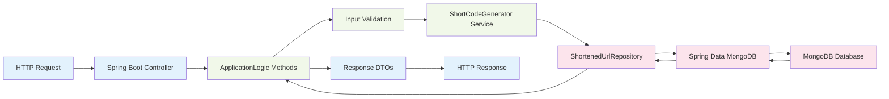
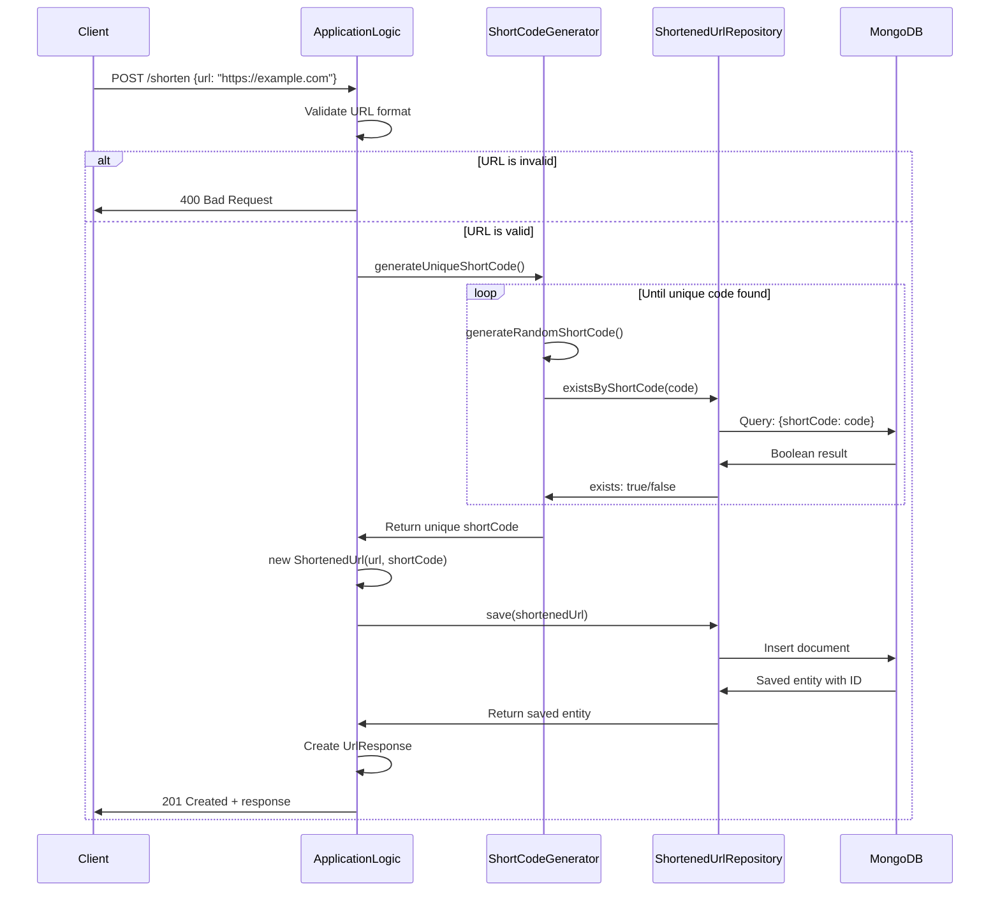
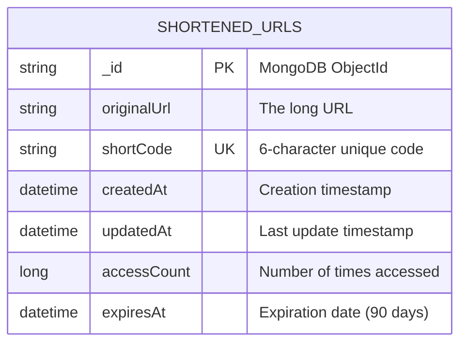
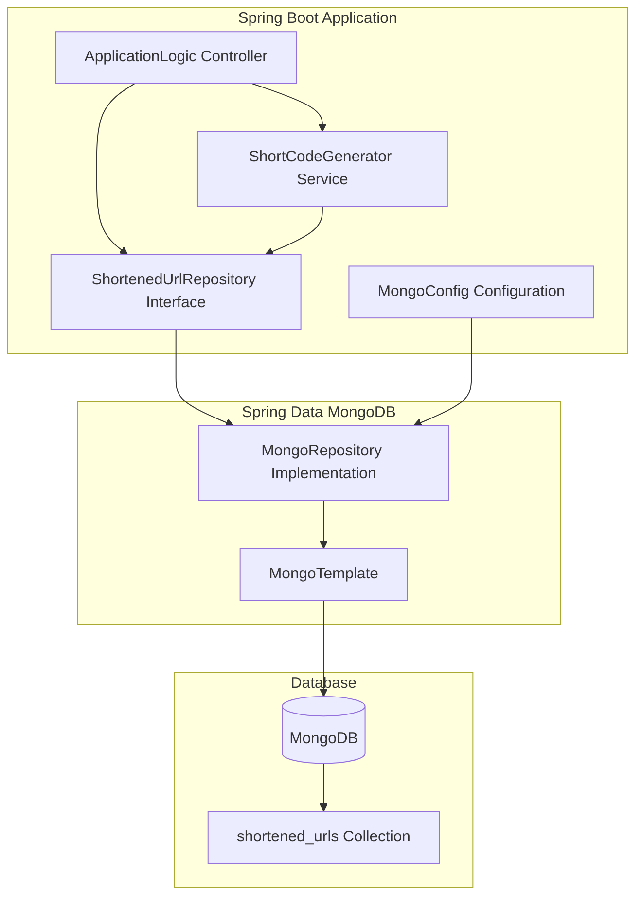

# URL Shortener API Flow Diagram

## Complete Low-Level Flow for All Endpoints

```mermaid
graph TD
    A[Client Request] --> B{Which Endpoint?}
    
    %% POST /shorten - Create Short URL
    B -->|POST /shorten| C[POST: Create Short URL]
    C --> C1[Receive ShortenUrlRequest]
    C1 --> C2{URL Validation}
    C2 -->|Invalid| C3[Return 400 Bad Request]
    C2 -->|Valid| C4[ShortCodeGenerator.generateUniqueShortCode()]
    C4 --> C5[Generate Random 6-char Base62 Code]
    C5 --> C6[Check Repository.existsByShortCode()]
    C6 -->|Exists| C5
    C6 -->|Unique| C7[Create ShortenedUrl Entity]
    C7 --> C8[Set originalUrl, shortCode, timestamps]
    C8 --> C9[Repository.save() - MongoDB Insert]
    C9 --> C10[Return 201 Created + UrlResponse]
    
    %% GET /shorten/{shortCode} - Retrieve URL
    B -->|GET /shorten/{code}| D[GET: Retrieve URL Info]
    D --> D1[Extract shortCode from path]
    D1 --> D2[Repository.findByShortCode()]
    D2 --> D3{Found in MongoDB?}
    D3 -->|No| D4[Return 404 Not Found]
    D3 -->|Yes| D5{URL Expired?}
    D5 -->|Yes| D4
    D5 -->|No| D6[Entity.incrementAccessCount()]
    D6 --> D7[Repository.save() - Update MongoDB]
    D7 --> D8[Return 200 OK + UrlResponse]
    
    %% PUT /shorten/{shortCode} - Update URL
    B -->|PUT /shorten/{code}| E[PUT: Update URL]
    E --> E1[Extract shortCode + ShortenUrlRequest]
    E1 --> E2{New URL Valid?}
    E2 -->|Invalid| E3[Return 400 Bad Request]
    E2 -->|Valid| E4[Repository.findByShortCode()]
    E4 --> E5{Found in MongoDB?}
    E5 -->|No| E6[Return 404 Not Found]
    E5 -->|Yes| E7[Entity.setOriginalUrl()]
    E7 --> E8[Entity.setUpdatedAt()]
    E8 --> E9[Repository.save() - Update MongoDB]
    E9 --> E10[Return 200 OK + UrlResponse]
    
    %% DELETE /shorten/{shortCode} - Delete URL
    B -->|DELETE /shorten/{code}| F[DELETE: Remove URL]
    F --> F1[Extract shortCode from path]
    F1 --> F2[Repository.deleteByShortCode()]
    F2 --> F3{Deletion Count > 0?}
    F3 -->|No| F4[Return 404 Not Found]
    F3 -->|Yes| F5[Return 204 No Content]
    
    %% GET /shorten/{shortCode}/stats - Get Statistics
    B -->|GET /shorten/{code}/stats| G[GET: URL Statistics]
    G --> G1[Extract shortCode from path]
    G1 --> G2[Repository.findByShortCode()]
    G2 --> G3{Found in MongoDB?}
    G3 -->|No| G4[Return 404 Not Found]
    G3 -->|Yes| G5[Return 200 OK + UrlResponse with accessCount]
    
    %% GET /{shortCode} - Direct Redirect
    B -->|GET /{code}| H[GET: Direct Redirect]
    H --> H1[Extract shortCode from path]
    H1 --> H2[Repository.findByShortCode()]
    H2 --> H3{Found in MongoDB?}
    H3 -->|No| H4[Return 404 Not Found]
    H3 -->|Yes| H5{URL Expired?}
    H5 -->|Yes| H4
    H5 -->|No| H6[Entity.incrementAccessCount()]
    H6 --> H7[Repository.save() - Update MongoDB]
    H7 --> H8[Return 302 Redirect to Original URL]
    
    %% Styling
    classDef endpoint fill:#e1f5fe
    classDef database fill:#f3e5f5
    classDef validation fill:#fff3e0
    classDef response fill:#e8f5e8
    classDef error fill:#ffebee
    
    class C,D,E,F,G,H endpoint
    class C9,D2,D7,E4,E9,F2,G2,H2,H7 database
    class C2,E2 validation
    class C10,D8,E10,F5,G5,H8 response
    class C3,D4,E3,E6,F4,G4,H4 error
```

## Data Flow Architecture



## Sequence Diagram for POST /shorten



## MongoDB Document Structure



## Key Components Interaction


